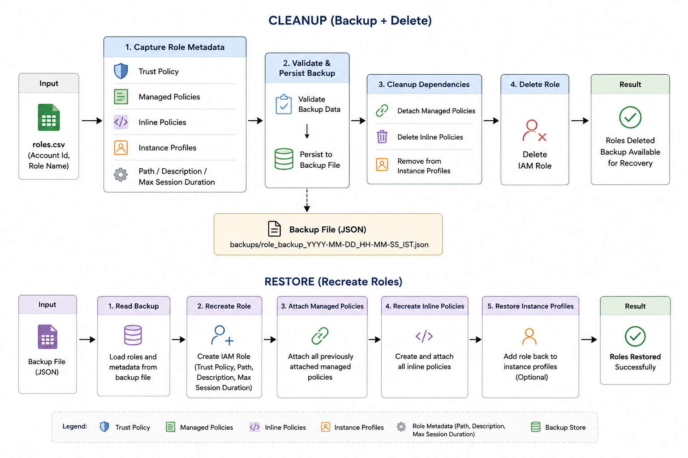

# IAM Role Cleanup with Backup & Recovery

## Overview

This implementation extends the IAM Role Cleanup framework by introducing backup and recovery capabilities before role deletion.

Prior to removing any IAM role, the framework captures and stores all metadata required to recreate the role later. This ensures that deleted roles can be restored if required while maintaining the existing cleanup workflow.

The current implementation is designed for single-account execution using AWS Profile based authentication and has been validated through end-to-end testing.

---

## Architecture

<p align="center">
  
</p>

<p align="center">
  IAM Role Backup, Cleanup & Restoration Flow
</p>

---

## Features

### Role Backup

Before deletion, the framework captures:

- Trust Policy
- Managed Policy Attachments
- Inline Policies
- Instance Profile Associations
- Role Path
- Role Description
- Max Session Duration

---

### Safe Deletion Workflow

A role is deleted only after:

1. Metadata is captured successfully
2. Backup validation passes
3. Backup is written successfully

If backup creation fails, deletion is skipped.

---

### Incremental Backup Persistence

Backups are written incrementally during execution.

Benefits:

- Prevents loss of captured data if execution stops midway
- Supports long-running cleanup operations
- Allows recovery from partial execution failures

---

### Timestamp-Based Backups

Backup files are generated automatically and stored separately.

Example:

```text
backups/
└── role_backup_2026-06-12_15-53-08_IST.json
```

This prevents previous backups from being overwritten and allows historical recovery.

---

### Parallel Role Processing

The framework supports concurrent role cleanup using configurable worker pools.

Configuration:

```python
ACCOUNT_WORKERS
ROLE_WORKERS
```

Current implementation:

```text
Single Account
Parallel Role Cleanup
```

---

### Dependency Cleanup

Before role deletion, the framework removes:

#### Managed Policies

```python
detach_role_policy()
```

#### Inline Policies

```python
delete_role_policy()
```

#### Instance Profile Associations

```python
remove_role_from_instance_profile()
```

#### Role

```python
delete_role()
```

---

### Retry Mechanism

The cleanup process includes retry handling with exponential backoff for throttling and rate limit related failures.

Configuration:

```python
MAX_RETRY_ATTEMPTS
BASE_BACKOFF_SECONDS
```

---

### Error Reporting

Execution failures are captured with detailed context including:

- Account ID
- Role Name
- Stage
- Operation
- Error Type
- Error Message
- Timestamp

Output:

```text
output/role_deletion_errors.csv
```

---

### Execution Summary

At the end of execution, a summary is generated showing:

```text
BACKUP Success=x Failed=y
DELETE Success=x Failed=y
RESTORE Success=x Failed=y
SKIPPED x
```

---

## Backup File Structure

Example:

```json
{
  "RoleName": {
    "path": "/",
    "description": "Example role",
    "max_session_duration": 3600,
    "trust_policy": {},
    "managed_policies": [],
    "inline_policies": {},
    "instance_profiles": []
  }
}
```

---

## Role Restoration

A separate utility is provided to recreate deleted roles from backup files.

### Restore All Roles

```bash
python3 restore_roles.py backups/<backup-file>.json
```

### Restore Selected Roles

```bash
python3 restore_roles.py \
backups/<backup-file>.json \
--roles RoleA,RoleB
```

### Dry Run

```bash
python3 restore_roles.py \
backups/<backup-file>.json \
--dry-run
```

### Restore Instance Profile Associations

```bash
python3 restore_roles.py \
backups/<backup-file>.json \
--restore-profiles
```

---

## Configuration

Configuration values are managed through:

```text
config/settings.py
```

Key parameters:

```python
ACCOUNT_WORKERS
ROLE_WORKERS
MAX_RETRY_ATTEMPTS
BASE_BACKOFF_SECONDS
INPUT_CSV
AWS_PROFILE
DRY_RUN
```

---

## Execution

### Dry Run

```python
DRY_RUN = True
```

```bash
python3 main.py
```

Captures and validates backups without deleting roles.

---

### Actual Cleanup

```python
DRY_RUN = False
```

```bash
python3 main.py
```

Performs backup, dependency cleanup, and role deletion.

---

## Validation Performed

The implementation has been validated for:

- Metadata Backup
- Backup Persistence
- Parallel Execution
- Dependency Cleanup
- Role Deletion
- Role Restoration
- Managed Policy Recovery
- Inline Policy Recovery
- Instance Profile Recovery
- Path Restoration
- Description Restoration
- Max Session Duration Restoration

---

## Current Scope

Supported:

- AWS Profile Based Authentication
- Single Account Execution
- Parallel Role Cleanup
- Backup & Recovery

---
