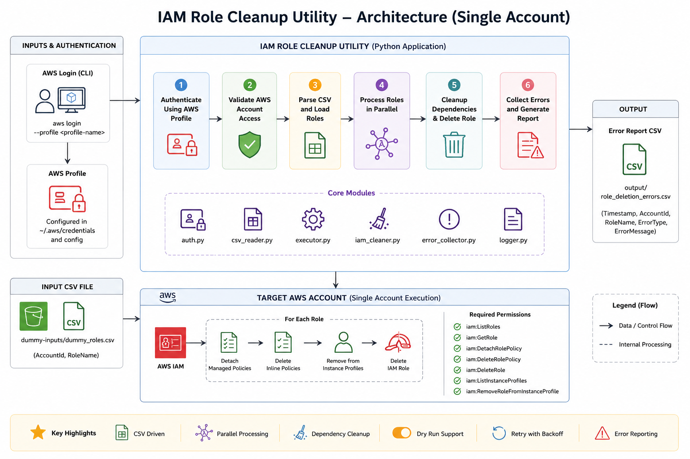

# IAM Role Cleanup Utility - Single AWS Account

## Overview

IAM Role Cleanup Utility is a Python-based automation tool designed to perform bulk IAM role cleanup within an AWS account.

The utility reads role information from a CSV file, validates the target account, removes role dependencies, and deletes IAM roles using configurable parallel execution. It also supports dry-run validation and detailed error reporting to ensure safe execution.

This implementation is intended for profile-based execution against a single AWS account.

---

## Architecture

<p align="center">
  
</p>

<p align="center">
  Single-account IAM role cleanup workflow using AWS Login profile authentication.
</p>

---

## Key Features

- CSV-driven role processing
- Parallel role deletion using worker threads
- Dry-run mode for validation before execution
- Automatic cleanup of role dependencies
- Retry handling for throttling scenarios
- Error collection and CSV reporting
- AWS account validation before execution
- Modular and extensible code structure

---

## Dependency Cleanup

Before deleting a role, the utility automatically removes associated dependencies:

- Attached managed policies
- Inline policies
- Instance profile associations

This prevents common IAM deletion failures caused by existing role dependencies.

---

## Project Structure

```text
.
├── cfn/
│   └── iam-role-cleanup.yaml
│
├── config/
│   └── settings.py
│
├── docs/
│   └── architecture-single-account.png
│
├── modules/
│   ├── auth.py
│   ├── csv_reader.py
│   ├── error_collector.py
│   ├── executor.py
│   ├── iam_cleaner.py
│   └── logger.py
│
├── tests/
│   ├── test_auth.py
│   └── test_csv_reader.py
│
├── main.py
├── requirements.txt
└── README.md
```

---

## Input Format

The utility expects a CSV file containing IAM role information.

Example:

```csv
AccountId,Name
123456789012,SampleRoleA
123456789012,SampleRoleB
123456789012,SampleRoleC
```

A sample file is provided under:

```text
dummy-inputs/dummy_roles.csv
```

---

## Authentication

Authentication is performed using an AWS profile configured through AWS Login.

Example:

```bash
aws login --profile non-prod-admin
```

The profile name is configured in:

```python
config/settings.py
```

Example:

```python
AWS_PROFILE = "non-prod-admin"
```

---

## Configuration

Application behavior is controlled through:

```python
config/settings.py
```

Important parameters:

```python
ACCOUNT_WORKERS
ROLE_WORKERS
MAX_RETRY_ATTEMPTS
BASE_BACKOFF_SECONDS
DRY_RUN
AWS_PROFILE
INPUT_CSV
```

---

## Execution Flow

```text
AWS Profile Authentication
            ↓
Account Validation
            ↓
CSV Parsing
            ↓
Parallel Role Processing
            ↓
Dependency Cleanup
            ↓
Role Deletion
            ↓
Error Reporting
```

---

## Running the Utility

### Validate Access

```bash
python3 tests/test_auth.py
```

### Validate CSV Parsing

```bash
python3 -m tests.test_csv_reader
```

### Dry Run

```python
DRY_RUN = True
```

```bash
python3 main.py
```

### Actual Execution

```python
DRY_RUN = False
```

```bash
python3 main.py
```

---

## Error Reporting

Failed operations are captured in:

```text
output/role_deletion_errors.csv
```

The report contains:

- Timestamp
- Account ID
- Role Name
- Error Type
- Error Message

This allows failed roles to be reviewed and retried separately if required.

---

## Validation Performed

The implementation has been validated for:

- CSV-driven role processing
- Profile-based AWS authentication
- IAM role dependency cleanup
- Parallel role execution
- Dry-run validation
- Error reporting workflow
- IAM role deletion within a target AWS account

---

## CloudFormation Template

A CloudFormation template is included under:

```text
cfn/iam-role-cleanup.yaml
```

The template provisions an IAM role with the permissions required to perform IAM role cleanup activities.

---

## Current Scope

This branch supports:

- Single AWS account execution
- AWS profile-based authentication
- Bulk IAM role cleanup from CSV input

Future enhancements such as cross-account execution and STS AssumeRole workflows are maintained separately from this implementation.
