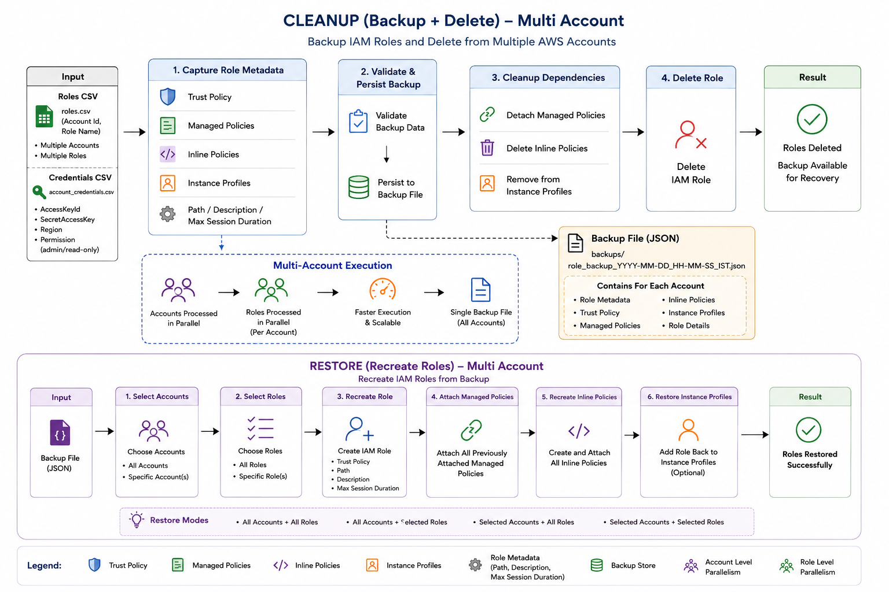

# IAM Role Cleanup - Backup & Restore (Multi-Account)

## Overview

This branch extends the IAM Role Cleanup utility with backup and restoration capabilities while introducing support for multi-account execution.

Before any role deletion is performed, the script captures the complete IAM role configuration and stores it in a backup file. The backup can later be used to recreate deleted roles, including trust relationships and policy attachments.

The current implementation is designed for local execution using AWS profiles. Jenkins-based AssumeRole execution will be implemented separately.

---

## Key Capabilities

| Capability                   | Supported |
| ---------------------------- | --------- |
| Single Account Execution     | Yes       |
| Multi-Account Execution      | Yes       |
| Automatic Role Backup        | Yes       |
| Role Restoration             | Yes       |
| Parallel Account Processing  | Yes       |
| Parallel Role Processing     | Yes       |
| Profile-Based Authentication | Yes       |
| Dry Run Support              | Yes       |

---

## Solution Flow

### Backup & Delete Flow

```text
Role CSV
    │
    ▼
Account Mapping
    │
    ▼
AWS Profile Resolution
    │
    ▼
Backup Role Configuration
    │
    ▼
Detach Policies
    │
    ▼
Remove Instance Profile Associations
    │
    ▼
Delete Role
```

### Restore Flow

```text
Backup File
    │
    ▼
Select Account(s)
    │
    ▼
Select Role(s)
    │
    ▼
Create IAM Role
    │
    ▼
Attach Managed Policies
    │
    ▼
Restore Inline Policies
    │
    ▼
(Optional) Restore Instance Profiles
```

---

## Architecture



---

## Backup Structure

A single backup file is generated for each execution.

The backup contains:

* Backup metadata
* Account information
* Role definitions
* Trust policies
* Managed policy attachments
* Inline policies
* Instance profile associations

Example structure:

```json
{
  "backup_metadata": {
    "created_at": "...",
    "total_accounts": 1,
    "total_roles": 8
  },
  "accounts": {
    "123456789012": {
      "roles": {}
    }
  }
}
```

---

## Input Files

### Role Input

```text
dummy-inputs/
└── poc_roles.csv
```

Example:

```csv
AccountId,AccountCategory,Type,Name
123456789012,POC,Role,SampleRole
```

### Account Credentials

```text
inputs/
└── account_credentials.csv
```

Example:

```csv
AccountId,AccessKeyId,SecretAccessKey,Region,Permission
123456789012,XXXX,XXXX,ap-south-1,admin
```

Profiles are automatically created using:

```text
<AccountId>-<Permission>
```

Example:

```text
123456789012-admin
```

---

## Execution Model

### Account-Level Parallelism

Multiple accounts can be processed concurrently.

### Role-Level Parallelism

Within each account, roles are processed concurrently.

This reduces overall execution time for large IAM cleanup operations.

---

## Restore Options

The restore utility supports:

* Restoring all accounts
* Restoring a specific account
* Restoring all roles from an account
* Restoring selected roles

Dry-run mode is available for validation before actual restoration.

---

## Local Testing

POC testing can be performed using:

```text
dummy-inputs/poc_roles.csv
```

and a corresponding credentials file.

This allows validation of:

* Backup generation
* Role deletion
* Role restoration
* Multi-account processing logic

without requiring Jenkins integration.

---

## Current Scope

Included in this branch:

* Multi-account support
* Profile-based authentication
* Backup generation
* Role restoration
* Parallel execution

Not included in this branch:

* Jenkins integration
* Cross-account AssumeRole execution
* Automated IAM cleaner role creation
* Operator account orchestration

These capabilities will be implemented in a dedicated Jenkins/AssumeRole branch.

---

## Output Artifacts

### Backup Files

```text
backups/
```

Generated before role deletion.

### Error Reports

```text
output/
```

Generated when failures occur during backup, deletion, or restoration.

---

## Safety Controls

* Backup captured before deletion
* Dry-run support
* Retry handling for throttling
* Error reporting with CSV output
* Role existence validation before restore
* Thread-safe backup persistence
